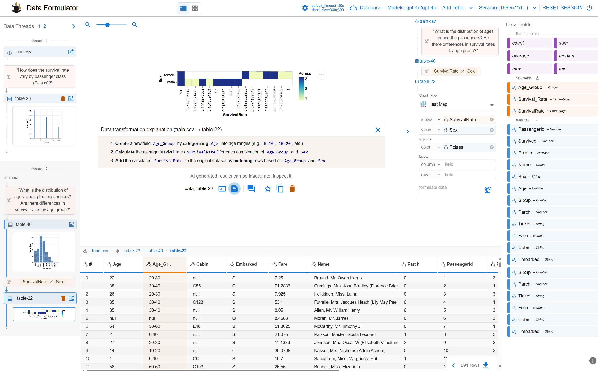

# AI Based Data Visualization

MSR Data Formulator + Foundry + GPT4o



## Create a VENV

```powershell
$VERSION="3.12";
$ENV_NAME="azfdymcp";
$ENV_SURFIX="uv";

$ENV_FULL_NAME = "$ENV_NAME$VERSION$ENV_SURFIX";
# with the closing "\"
$ENV_DIR="$env:USERPROFILE\Documents\VENV\";

# absolute path of requirements.txt to install for the python venv
$PROJ_DIR="$env:USERPROFILE\Documents\VCS\democollections\agents-samples";
$SubProj=""
$typeProj="_fdy"
$PackageFile="$PROJ_DIR\${SubProj}requirements${typeProj}.txt";

& "$ENV_DIR$ENV_FULL_NAME\Scripts\Activate.ps1";
Invoke-Expression "(Get-Command python).Source";

## Start data formulator
python -m data_formulator --port 8084
```

```
http://localhost:8084
```

## How you get the keys
### For AI Foundry Project v2
`gpt-4o` model is deployed through an additional AOAI resource and deployment
Use the "get endpoint" of the AOAI resource
* API Base is the "Endpoint", API Key is the "ENDPOINT" key
* Model name is the deployed model name
* API Version: `2024-12-01-preview`

### For AI hub based Project v2
`gpt-4o` model deployed in the hub will be automatically re-routet:
Use the AOAI endpoint  


## Reference
* Opensource Code Data Formulator (AI Report Visualization) https://github.com/microsoft/data-formulator
* Data Formulator Blog Post https://www.microsoft.com/en-us/research/blog/data-formulator-exploring-how-ai-can-help-analysts-create-rich-data-visualizations/?msockid=3d7008831e886de00bfb1d6a1feb6caf